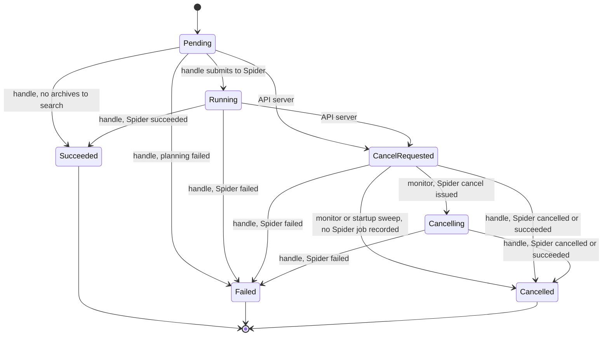

# Query job cancellation support in `query-coordinator`

Design and implementation plan.

---

# 1. Background

CLP can run query jobs through two different schedulers:

* The legacy **Celery** path: the Python `query_scheduler` picks up jobs from the `query_jobs` MariaDB table and dispatches per-archive tasks to Celery `query-worker`s.
* The new **Spider** path: the Rust `query-coordinator` picks up the same jobs and submits each one to Spider as a single task graph, one task per archive.

In the Spider path, three components touch a job's row in `query_jobs`:

* **API server** — accepts the user's request to cancel a query and records it.
* **`query-coordinator` main loop** — polls for new jobs and spawns a detached **job handle** per job.
* **Job handle** — plans the job, submits it to Spider, waits for the Spider job to finish, and writes the job's terminal status.

Query job status is persisted as an integer in `query_jobs.status` and mirrored in four places across three languages (§4.1).

## 1.1 What is missing

Cancellation is not implemented for the Spider path. The API server can write a "cancelling" status, but nothing in `query-coordinator` ever acts on it:

* No component cancels the Spider job, so a cancelled query keeps consuming workers and writing results until it finishes naturally.
* No component drives the row out of the cancelling status, so the job never reaches a terminal state. A user polling the API waits forever.
* Nothing recovers a cancelling job across a coordinator restart.

## 1.2 Why it is not trivial

The three components act asynchronously and none of them can see the others' in-memory state. The design must therefore be correct for every interleaving, using only what is persisted in the row.

A cancellation can arrive at any point in a job's life — before the coordinator has seen the job, while the handle is planning, during the submission to Spider, while the Spider job is running, or after it has already finished. Each of those needs a defined outcome.

---

# 2. Design

## 2.1 Status values

`Cancelling` is split into two states so that "the user asked for a cancellation" is distinguishable from "the cancellation has been relayed to Spider".

| Name | Value | Meaning |
|---|---|---|
| `Pending` | 0 | Created, not yet picked up |
| `Running` | 1 | Submitted to Spider |
| `Succeeded` | 2 | Terminal |
| `Failed` | 3 | Terminal |
| `CancelRequested` | 4 | The user requested a cancellation; not yet relayed to Spider |
| `Cancelling` | 5 | The cancellation has been relayed to Spider; waiting for the Spider job to wind down |
| `Cancelled` | 6 | Terminal |
| `Killed` | 7 | Unused by `query-coordinator`; retained for the Celery path |

`Cancelling` is inserted directly after `CancelRequested`, which renumbers `Cancelled` and `Killed`. **This is a breaking change to the persisted encoding.** Existing `query_jobs` rows will be misinterpreted, so a deployment carrying this change needs its orchestration database recreated. All four mirrors must be updated in lockstep (§4.1).

Splitting the state is what makes the monitor's work safely repeatable: once a cancellation has been relayed, the row leaves the monitor's scan set, so the monitor never asks Spider to cancel the same job twice.

## 2.2 State machine



`CancelRequested --> Cancelled` has three distinct triggers, and all are required: the monitor sweeping a job that was never submitted to Spider, the startup sweep doing the same for such rows that outlived a restart (§4.5), and the handle terminating a job whose Spider work has finished. The first two are the same guarded transaction run by different callers.

## 2.3 State classes

* **Cancellable** — `Pending`, `Running`. Only these may be moved to `CancelRequested`, and only by the API server.
* **Cancel in progress** — `CancelRequested`, `Cancelling`. Both are **live**, not terminal: some component must still drive them to a terminal state.
* **Live** — `Pending`, `Running`, `CancelRequested`, `Cancelling`.
* **Terminal** — `Succeeded`, `Failed`, `Cancelled`.

## 2.4 Outcome priority

When a cancellation races a Spider outcome: **failed > cancelled > succeeded**.

A job in `CancelRequested` or `Cancelling` whose Spider job *succeeded* still terminates as `Cancelled` — the cancellation wins over the success. A job in either state whose Spider job *failed* terminates as `Failed` — the failure wins over the cancellation.

## 2.5 Correctness requirements

Every component must satisfy all of these. They are what make the design correct under arbitrary interleaving.

* **R1 — Every status write is a read-modify-write inside a transaction whose first statement is `SELECT status … WHERE id = ? FOR UPDATE` on that one row**, or a single conditional `UPDATE` carrying the precondition in its `WHERE` clause. Reading the current status under the row's exclusive lock, deciding in application code, writing, and committing means the precondition cannot go stale between the check and the write.
* **R2 — Every transaction locks exactly one row, by primary key.** A transaction that holds one lock and never requests a second holds nothing at the moment it waits, so it cannot be part of a lock cycle. This makes the system deadlock-free by construction. Any transaction that locks several rows, or that locks via a range scan on a secondary index, breaks this property.
* **R3 — No transaction is open across a Spider RPC.** Holding a row lock across a network call turns a sub-millisecond conflict into a window bounded only by `innodb_lock_wait_timeout` (50 s by default).
* **R4 — Scanning for work uses a non-locking `SELECT`.** A `SELECT … WHERE status = ? FOR UPDATE` is a locking range scan on the `status` index; under `REPEATABLE READ` it takes next-key locks that block inserts of new rows, and it violates R2.

---

# 3. Why the design is sound

The monitor decides, from the row alone, whether a Spider job needs cancelling, and it reads `spider_id` to do so. §3.1-3.4 establish why that decision is safe and which row states are even reachable. §3.5 covers the one window the row cannot describe: a Spider job that has been submitted but not yet started.

## 3.1 The monitor's read of `spider_id` is stable

`spider_id` is written in exactly one place: the handle's `start` transaction, which requires the row to be `Pending`. Once `CancelRequested` is committed, `start` can never succeed again, so **`spider_id` can never go from NULL to non-NULL after a cancellation is requested.**

The monitor therefore observes a value that cannot change under it. There is no database race against its decision, and it needs no lock to make one.

## 3.2 A Spider job that was never started consumes nothing

The handle submits the task graph to Spider and *then* writes `status = Running` and `spider_id`. There is a window in which a task graph exists in Spider but its ID is not yet in the database. If a cancellation lands inside that window, the monitor sees `spider_id IS NULL`, writes `Cancelled`, and the handle's `start` then aborts — leaving a task graph in Spider that nothing will ever reference.

That orphan is **inert**, not a leaked computation. In Spider, submitting a task graph leaves the job in `JobState::Ready`. Nothing is dispatched until `start_job` is called: `start()` in `spider-storage` requires the `Ready` state, sets `JobState::Running`, and only then enqueues the ready tasks onto the inbound queue that executors consume. The handle calls `start_job` from the code path that waits for completion, which runs **after** the `start` transaction has committed — so an orphan created in this window is never started, never dispatched, and never writes results. It costs a task-graph record in Spider's storage, nothing more.

This is why the design needs no extra bookkeeping to make the window safe. Optionally, the handle can cancel the task graph it just submitted if its own `start` transaction fails, using the Spider job ID it still holds in memory; that is tidy housekeeping to reclaim the storage, not a correctness requirement.

## 3.3 Invariants

* **I1** — Only the job handle, the cancellation monitor, and the startup sweep write `status`. The startup sweep runs the monitor's own M1 transaction (§4.5), so there are two distinct transaction shapes writing status, not three. At most one handle exists per job, enforced by the existing `dispatch_time` marker.
* **I2** — `spider_id` is written only by the handle's `start` transaction, which requires `Pending`.
* **I3** — Therefore, once `CancelRequested` is committed, `spider_id` can never become non-NULL (§3.1).
* **I4** — `Cancelling` implies `spider_id IS NOT NULL`, because the monitor sets `Cancelling` only after cancelling a Spider job whose ID it read from the row.
* **I5** — Therefore `Cancelling` is unreachable in `start`: `start` requires `Pending`, and `Pending` implies `spider_id IS NULL`.
* **I6** — A `Pending` row has no *started* Spider job, so re-dispatching one after a restart is safe (§4.5).

## 3.4 Reachable `(status, spider_id)` combinations

`status` and `spider_id` are not independent. Because `start` writes both in a single statement, and nothing else writes `spider_id` at all, half the grid is unreachable. Knowing which half matters: it is what lets the monitor decide what to do from the row alone.

| `status` | `spider_id` | Reachable | Meaning | Who can still transition it |
|---|---|---|---|---|
| `Pending` | NULL | yes | Created; not submitted | handle `start` → `Running`; handle `terminate` → `Succeeded` (empty plan) or `Failed` (planning failed); API → `CancelRequested` |
| `Pending` | set | **no** | — | `spider_id` is only ever written together with `status = Running` |
| `Running` | NULL | **no** | — | same statement writes both |
| `Running` | set | yes | Submitted to Spider | handle `terminate` → `Succeeded` / `Failed`; API → `CancelRequested` |
| `CancelRequested` | NULL | yes | Cancelled before submission | handle `terminate` → `Cancelled` / `Failed`; monitor **M1** or the startup sweep → `Cancelled` |
| `CancelRequested` | set | yes | Cancelled after submission | handle `terminate` → `Cancelled` / `Failed`; monitor **M2** → `Cancelling` |
| `Cancelling` | NULL | **no** | — | M2 only fires when `spider_id` is set (I4) |
| `Cancelling` | set | yes | Cancel relayed to Spider | handle `terminate` → `Cancelled` / `Failed` |
| terminal | NULL | yes | Finished without ever submitting | nobody |
| terminal | set | yes | Finished after submitting | nobody |

Note that `Running ∧ spider_id IS NULL` being unreachable is a property of writing both fields in one statement. Any design that records the Spider job ID in a separate transaction from the status creates that state, and with it a row whose Spider job may or may not exist — which nothing can subsequently resolve.

## 3.5 Cancelling a submitted-but-unstarted Spider job

There is a second window worth stating explicitly, because the row gives no hint of it. Submitting a task graph and *starting* it are two separate Spider calls, and the handle makes them at different times:

1. `submit_query_job` — the task graph is inserted and the Spider job sits in `JobState::Ready`.
2. the `start` transaction — the row becomes `Running` with `spider_id` recorded.
3. `start_job`, inside the code path that waits for completion — the Spider job goes `Ready → Running` and its tasks are enqueued for executors.

Between steps 2 and 3 the row reads `Running` with a `spider_id`, while the Spider job has not begun executing. A cancellation arriving here resolves correctly:

| Step | What happens |
|---|---|
| API server | `Running → CancelRequested`, `spider_id` set |
| Monitor, case B | `cancel_job` succeeds: `ensure_cancellable` rejects only `CleanupReady`, `Cancelled` and terminal states, so a `Ready` job **is** cancellable. Query task graphs have no cleanup task, so the job moves straight to `JobState::Cancelled` |
| Monitor, M2 | writes `Cancelling` under its guard |
| Handle, `start_job` | `ensure_ready` requires `Ready`, sees `Cancelled`, returns `StaleStateError::JobAlreadyStarted` → `FAILED_PRECONDITION` → `ClientError::InvalidJobState`, which the handle's existing tolerance around `start_job` swallows |
| Handle, poll | `get_job_state` returns `Cancelled`, which maps to the cancelled outcome |
| Handle, `terminate` | `Cancelled` from `Cancelling`, or from `CancelRequested` if M2 has not committed — both permitted |

Final status `Cancelled`, and **no task is ever dispatched**, because tasks are enqueued only inside Spider's own `start()`, which never ran. This is the best available outcome.

The opposite order is equally well-defined. If `start_job` wins the race, the Spider job goes `Running` with its tasks enqueued, the monitor's cancel then moves it to `Cancelled` and cancels the non-terminal tasks, and the handle's poll reaches the same terminal outcome. Spider serialises the two calls on the job control block's write lock, so exactly one wins, and `start_job` can never revive a cancelled job because `ensure_ready` admits only `Ready`.

**Two things this depends on, both easy to break:**

* **The handle's tolerance of `InvalidJobState` around `start_job` is load-bearing here**, not just for restart recovery. Remove it, or narrow it, and a cancellation landing in this window turns into a spurious `Failed` instead of `Cancelled`.
* **It requires the Spider fix in §5.** Without it, `start_job` on a cancelled job returns `INTERNAL`, the tolerance never fires, and the handle fails a job the user asked to cancel. This is an independent reason that fix is a prerequisite.

One cosmetic trap for whoever reads the logs: the error variant is named `JobAlreadyStarted` even when the job was *cancelled* rather than started. The name is misleading; the mapping is correct because both are `StaleState` variants.

---

# 4. Component changes

## 4.1 Shared status enum, and the Celery-side rename

The status enum is defined independently in four places. All four must be changed together, with identical names and values.

| Component | File | Change |
|---|---|---|
| Rust (shared) | `components/clp-rust-utils/src/job_config/search.rs` | Rename `Cancelling` → `CancelRequested`; insert `Cancelling` after it; renumber `Cancelled` and `Killed` |
| Python (Celery) | `components/job-orchestration/job_orchestration/scheduler/constants.py` | Same, in `class QueryJobStatus(StatusIntEnum)` |
| Python (MCP server) | `components/clp-mcp-server/clp_mcp_server/constants.py` | Same — this file **duplicates** the enum rather than importing it |
| TypeScript (web UI) | `components/webui/packages/server/src/typings/query.ts` | Same, in `enum QUERY_JOB_STATUS` |

The Python enums use `auto()` and the TypeScript enum uses implicit increments, so member *order* determines the value. Keep the order identical to §2.1 in all four.

**The Celery path needs a rename only — no behavioural change.** The Python `query_scheduler` uses the old `Cancelling` state to mean "the user requested a cancellation", which is exactly what `CancelRequested` now means. It never uses the new `Cancelling` state; that state belongs solely to the Spider path. Sites to update:

* `query_scheduler.py` — the query that fetches jobs whose cancellation was requested (`WHERE … status={QueryJobStatus.CANCELLING}`), and the `prev_status` guard on the transition to `CANCELLED`. Rename both to `CANCEL_REQUESTED`. One nearby comment also mentions the old name.
* `clp_mcp_server/clp_connector.py` — a `waiting_states` set containing the old `CANCELLING`. Rename it, **and add the new `CANCELLING`**, or a job in the new state matches neither `waiting_states` nor `error_states`.
* `search_result_garbage_collector.py` — verify the terminal-status set still lists only terminal states.

Note that the status *name* never reaches the database: `StatusIntEnum.__str__` returns the integer, so SQL built with f-strings embeds the value. The rename is therefore source-only on the Python side.

**Web UI:** besides the enum, update the "waiting states" set to include the new `Cancelling`, and the cancel guard in `QueryJobDbManager`.

Only Rust's exhaustive `match` will force callers to be updated. The Python and TypeScript changes must be audited by hand.

## 4.2 API server

Responsible for recording the user's intent, and for being the sole enforcer of which statuses are cancellable.

**Change:** in the cancellation handler (`components/api-server/src/client.rs`), write `CancelRequested` instead of the old `Cancelling`. The guard stays as a single conditional statement:

```sql
UPDATE query_jobs SET status = <CancelRequested> WHERE id = ? AND status IN (<Pending>, <Running>)
```

This is already correct and satisfies R1–R3: one autocommit statement against one row by primary key, with the `status IN (…)` predicate making it impossible to drag a terminal job back into a live state. It needs no transaction.

Also update the status match elsewhere in the same file that classifies a job as finished, in-progress or failed, so it handles the new `Cancelling` state. The compiler will flag it.

**Decision needed:** a second cancellation request against a row already in `CancelRequested` or `Cancelling` currently matches zero rows and surfaces as "job not found". Returning success is friendlier and arguably more correct — the user's intent is already recorded. Recommended: return success.

## 4.3 Job handle

Responsible for driving a job to a terminal state. It is the only component that knows whether it has submitted to Spider, which is why it — not the monitor — owns terminal status for any job it is driving.

The handle keeps its existing shape: plan, submit to Spider, write `status = Running` and `spider_id` in one `start` transaction, wait for the Spider job, then write the terminal status in one `terminate` transaction. Two things change.

**Change 1: `start`'s status check.** `start` reads the status under `FOR UPDATE` and acts on it:

| Observed | Action |
|---|---|
| `Pending` | Proceed |
| `CancelRequested` | Return the "job cancelled" error. The handle's existing error-finalisation path maps this to terminating the job as `Cancelled`, which §2.2 permits from `CancelRequested`. |
| Any terminal status | Return the "invalid status transition" error, carrying the observed status. The error-finalisation path must recognise a terminal observed status and write nothing at all. |
| `Running`, `Cancelling` | Return the "invalid status transition" error. Unreachable in practice — see I5. |

The distinction between the two error types matters. The "job cancelled" error causes a write (`Cancelled`); the "invalid transition from a terminal status" error must cause **no** write, because the row is already final. Routing a terminal observation through the cancellation error would attempt a transition from `Cancelled` to `Cancelled`, which is rejected and merely logs a spurious warning.

**Change 2: termination rules.** When the Spider job finishes, the handle opens a transaction, reads the status under `FOR UPDATE`, and resolves the status to persist:

| Spider outcome | Observed status | Persist |
|---|---|---|
| Succeeded | `Pending`, `Running` | `Succeeded` |
| Succeeded | `CancelRequested`, `Cancelling` | `Cancelled` — the cancellation wins |
| Cancelled | `CancelRequested`, `Cancelling` | `Cancelled` |
| Cancelled | `Running` | `Failed` — an unexpected, externally initiated cancellation |
| Failed | Any non-terminal | `Failed` — the failure wins |
| Any | Any terminal | Reject; write nothing |

Both `CancelRequested` and `Cancelling` must be accepted on the success path *and* the cancellation path, because the monitor may or may not have relayed the cancellation by the time the Spider job finishes.

**Optional:** if `start` fails after the task graph was submitted, the handle still holds the Spider job ID in memory and can cancel the now-orphaned graph. See §3.2 — housekeeping, not correctness.

## 4.4 Cancellation monitor coroutine

A new coroutine in `query-coordinator`, spawned alongside the main loop and sharing its cancellation token. It is the only component that talks to Spider about cancellation, and the only writer of `status` besides the job handle.

### Design assumption: cancellation is rare, and this monitor is deliberately not high-throughput

The monitor processes **one job at a time**, sequentially, with no parallelism. This is a deliberate trade: it is designed for correctness and simplicity on the assumption that cancellation is an infrequent, human-initiated action — a user abandoning a query — rather than a bulk or programmatic operation.

The consequences, stated plainly so nobody is surprised later:

* **Cancellation throughput is roughly one job per database-plus-Spider round trip**, on the order of hundreds per second rather than thousands. A backlog of *N* cancellations drains in *N* round trips.
* **Cancellation latency grows linearly with the backlog.** If 1000 jobs are cancelled at once, the last one is relayed to Spider only after the other 999, so its worst-case latency is roughly 1000 round trips. Each individual job is still cancelled correctly; it just waits its turn.
* **This is not suitable as a bulk-cancellation mechanism.** If a future feature needs "cancel every job in this dataset" or "cancel everything" as a fast operation, this monitor is the wrong tool, and parallelising it reintroduces the two hazards that sequential processing removes (see below). Revisit the design rather than raising a concurrency knob.

If that assumption ever stops holding, the thing to reach for is batching the *database* work — one transaction relaying several already-cancelled Spider jobs — not concurrent coroutines, because the per-row transactions are what keep R2 satisfied.

### Loop

```
loop {
    row = SELECT id, spider_id
          FROM query_jobs
          WHERE status = <CancelRequested>
          ORDER BY id ASC
          LIMIT 1;                  -- non-locking read, per R4

    match row {
        None    => sleep(interval),                 // nothing to do; idle
        Some(r) => {
            match r.spider_id {
                NULL     => M1,                     // nothing recorded to cancel
                Some(id) => { cancel_spider(id); M2 }
            }
            continue;                               // drain without sleeping
        }
    }
}
```

The loop sleeps only when it finds nothing, so a backlog drains at full round-trip speed and an idle coordinator does one cheap indexed lookup per interval.

The `LIMIT 1` query is **discovery only** — it finds a candidate and takes no locks. Both state transitions below are locked, guarded, single-row transactions.

### The two cases

Per §3.4, a row the discovery query returns is in exactly one of two reachable combinations:

| Discovered | Spider job exists? | Monitor action | What can change before the transition commits |
|---|---|---|---|
| `CancelRequested`, `spider_id IS NULL` | No recorded job; any unrecorded graph is inert (§3.2) | **M1** — one transaction, no Spider call | handle `terminate` → `Cancelled` (empty plan, or the cancellation path) or `Failed` (planning failed) |
| `CancelRequested`, `spider_id` set | Yes | Cancel it in Spider, then **M2** | handle `terminate` → `Cancelled` (Spider cancelled or succeeded) or `Failed` (Spider failed) |

Neither row's `spider_id` can change under the monitor — it is written only by `start`, which requires `Pending` (I2, I3) — so the branch decision taken at discovery stays valid. What *can* change is the **status**, in both cases, because the job handle is concurrently driving the same job. That is why both transitions are guarded.

**Both M1 and M2 are transactions, with the same shape.** Neither is a bare `UPDATE`: each re-reads the status under the row's exclusive lock, decides, writes, and commits, exactly as the job handle's own transitions do (R1).

```
BEGIN
  SELECT status, spider_id FROM query_jobs WHERE id = ? FOR UPDATE
  match status {
      CancelRequested => UPDATE query_jobs SET status = <target> WHERE id = ?
      other           => log, write nothing          -- see below
  }
COMMIT                                                -- or roll back on mismatch
```

* **M1 — sweep a job with no recorded Spider job.** Target `Cancelled`. No Spider call is needed or made.
* **M2 — record that the cancellation was relayed.** Target `Cancelling`. Run only *after* Spider has accepted the cancellation, so that the state means what it says. The row then leaves the discovery set and the cancel is never re-issued.

Re-reading `status` inside the transaction — rather than trusting the discovery query — is what makes the precondition impossible to stale between the check and the write. Selecting `spider_id` as well and asserting it still matches the branch taken is cheap and worth doing defensively, though not load-bearing (I3).

**A precondition mismatch is a normal outcome, and must be logged.** In both cases the job handle may terminate the job first — it is waiting on the same Spider job, and in the `spider_id IS NULL` case it can reach `terminate` without ever touching Spider at all. The monitor then observes something other than `CancelRequested`, writes nothing, and moves to the next candidate.

Requirements for that path:

* **Write nothing and commit or roll back cleanly.** Do not attempt the `UPDATE`.
* **Log it at `INFO`**, not `DEBUG`. This is the single line that explains, after the fact, why a cancellation did not produce the transition the operator expected, and cancellation is rare enough that the volume is negligible. Include the query job ID, the status actually observed, and which transition was being attempted — for example: *"Skipping the cancellation transition: the query job is no longer in `CancelRequested`."* with `query_job_id`, `observed_status` and the intended target as structured fields.
* **Do not retry, and do not treat it as a failure.** Either would spin forever on a row that is already finished.

Both transactions lock exactly one row by primary key, and in case B the Spider RPC happens between transactions with none open, satisfying R2 and R3.

### Why the Spider RPC stays outside the transaction

It would be simpler to hold the row lock across the whole operation — lock, cancel in Spider, write `Cancelling`, commit — and that is **not** a deadlock risk: a transaction waiting on a network call is not waiting on a lock, so it cannot be part of a wait-for cycle. The cost is blocking, and it falls on the wrong party:

* **It blocks the job handle's `terminate`, which is the component doing the useful work.** This is near-certain rather than hypothetical: cancelling the Spider job is what drives it terminal, so the handle wakes from its poll and tries to terminate the job precisely while the monitor holds the lock across the RPC.
* **The tail is unbounded.** Normally the RPC takes milliseconds. If `spider-storage` is slow, saturated or unresponsive, the lock is held for as long as the client waits, and anything queued behind it — the handle, the API server's cancel, the main loop's `dispatch_time` stamp if that row is in its batch — can reach `innodb_lock_wait_timeout` (50 s) and surface a database error.

Holding the lock would buy only one thing: discovering a concurrent termination *before* calling Spider, avoiding a pointless cancel in a rare race. Outside the lock, that cancel is issued and Spider answers "already terminal" or "already requested", which requirement 2 below already treats as success. A rare harmless RPC is the better trade.

### What sequential processing buys

Two hazards that a parallel monitor would have to defend against do not arise at all:

* **No connection-pool exhaustion.** The coordinator's default `max_concurrent_jobs` is 1000 against a `database_connection_pool_size` of 10, with a 30 s connection-acquire timeout. A fan-out of coroutines over a large cancel backlog would exhaust the pool and surface as opaque database errors. One job at a time needs one connection at a time.
* **No in-flight tracking.** A row stays `CancelRequested` until its cancel succeeds, so a parallel monitor would re-select rows it was already processing and would need a mutex-guarded set of in-flight IDs to avoid duplicate Spider cancels. With one job in flight by construction, there is nothing to track.

### Two requirements that remain

1. **The query must not use `FOR UPDATE`** (R4). Because cancellation is rare, the usual outcome is *no match*, and under `REPEATABLE READ` a locking read that matches nothing still gap-locks the position where such a row would sit in the `status` index. The API server's cancel is an `UPDATE … SET status = CancelRequested`, which must insert an index entry into exactly that gap — so a locking query would briefly block the only operation that creates the monitor's work. A row lock would also have to span the Spider RPC to be useful, violating R3.
2. **`cancel_job` must tolerate `FAILED_PRECONDITION` (`ClientError::InvalidJobState`) and still advance to M2.** This mirrors the tolerance the handle already has around `start_job`, and for the same reason: the error means there is nothing left to cancel, not that something went wrong.

   Spider's `ensure_cancellable` rejects exactly three situations, all of them `StaleState` variants that the §5 fix surfaces as `FAILED_PRECONDITION`:

   | Spider job state | Error variant | What it means |
   |---|---|---|
   | `CleanupReady` | `JobCancellationAlreadyRequested` | a cancellation is already in progress |
   | `Cancelled` | `JobAlreadyCancelled` | already cancelled |
   | `Succeeded`, `Failed`, `Cancelled` | `JobAlreadyTerminated(state)` | the job finished on its own first |

   In every case the correct action is the same: treat it as a successful cancel and run **M2**, which writes `Cancelling` if and only if the row is still `CancelRequested`. The job handle is concurrently polling that Spider job, will observe its terminal state, and will write the terminal CLP status itself — so the monitor's job is done either way.

   The outcome is still correct when Spider had already finished, because the priority rules in §2.4 resolve it: a Spider job that had already **succeeded** gives the handle `terminate(Succeeded)` from `Cancelling`, which persists `Cancelled` (the cancellation wins); one that had already **failed** gives `terminate(Failed)`, which persists `Failed` (the failure wins). Writing `Cancelling` after the Spider job is already terminal is therefore harmless — it records that the relay happened and hands the row to the handle.

   **A transient failure is the opposite case and must not advance.** A network error, an unavailable `spider-storage`, or any error that is *not* `InvalidJobState` should leave the row in `CancelRequested` so the next iteration retries. That is what makes the relay at-least-once, with the `CancelRequested → Cancelling` transition as the acknowledgement. Advancing on a transient error would strand the Spider job running with nothing left to cancel it.

### Multiple coordinator instances

Sequential processing gives exclusion *within* an instance, not across instances: two coordinators would each pick the same row and both cancel the same Spider job. That is already outside this design's single-writer assumption, and the duplicate is harmless — with the fix in §5 it returns a distinguishable "already requested" error that requirement 2 treats as success. No locking or leader election is needed for this to be safe.

**Errors must never terminate the coordinator.** Log and continue. Note that the existing main loop propagates some database errors with a bare `?`, which exits the process and leaves Compose to restart it a bounded number of times; do not copy that pattern here.

**Decision needed:** the idle interval. Reusing the main loop's job-polling interval (50 ms) is simple; a separate interval of a few hundred milliseconds reduces idle query load at negligible cost, since the loop only sleeps when there is nothing to cancel.

## 4.5 Coordinator startup recovery

The main loop should continue to fetch only `Pending` rows for new work. Startup recovery, however, must cover every live state, or a restart strands cancelling jobs exactly as today.

| Row state at startup | Action | Handle? |
|---|---|---|
| `Running`, `spider_id` set | Existing behaviour: spawn a handle that waits for the Spider job and terminates it | yes |
| `CancelRequested` or `Cancelling`, `spider_id` set | Spawn a handle the same way. For `CancelRequested`, the monitor relays the cancel on its next tick | yes |
| **`CancelRequested`, `spider_id IS NULL`** | **Terminate as `Cancelled` during startup** | **no** |
| `Pending`, `dispatch_time` set | Re-dispatch. Safe per I6, and the right outcome — the user's query completes | yes |

The existing recovery query filters on `status = Running AND spider_id IS NOT NULL`; widen it to include `CancelRequested` and `Cancelling`.

### Sweeping `CancelRequested` rows with no Spider job

These rows are resolved directly at startup and **no job handle is created for them**, because there is nothing for a handle to do:

* No Spider job is recorded, and any task graph submitted in the unrecorded window is inert (§3.2) — after a restart there is also no in-memory handle left that could ever record an ID.
* `spider_id` can never become non-NULL from `CancelRequested` (I3), so the row's fate is already determined.
* Spawning a handle would mean planning and submitting a Spider job for a query the user has already cancelled, then immediately cancelling it.

So the outcome is known without consulting Spider: write `Cancelled` and move on. Two implementation details:

**One transaction per row, not one statement for all of them.** The tempting form is a single `UPDATE … SET status = Cancelled WHERE status = CancelRequested AND spider_id IS NULL`, but that locks every matching row in one statement and acquires those locks progressively as it scans, which makes it the only hold-and-wait transaction in the system and breaks R2. Iterate instead, using the same guarded single-row transaction as M1 (§4.4), including its `INFO` log on a precondition mismatch. The set is small by construction — only jobs cancelled before submission that outlived a restart, normally zero — so per-row costs nothing.

**Run the sweep before starting the monitor and the main loop.** Then nothing can race it and the table is in a fully resolved state before the coordinator accepts new work. If the sweep instead runs concurrently with the monitor, both will target the same rows; the guard makes that safe, but the ordering is free and makes recovery deterministic.

A crash between the Spider submission and the `start` commit leaves the row `Pending`, so it is re-dispatched and the query runs normally. The abandoned task graph from the first attempt is inert (§3.2), so re-dispatching cannot duplicate any real work — it costs one unused task-graph record in Spider's storage.

---

# 5. External dependency: Spider's cancel error mapping

**This must be fixed before the monitor can work.**

Spider's `cancel_job` rejects a repeat cancellation with `StaleStateError::JobCancellationAlreadyRequested`, raised from `ensure_cancellable` in `components/spider-storage/src/cache/job.rs`. That error reaches the client through `job_orchestration_service_error_handler` in `components/spider-storage/src/grpc.rs`, which has **no arm for `StorageServerError::Cache(CacheError::StaleState(_))`**. It therefore falls through to the default handler and is returned as `Status::internal`, and `spider-client` maps only `FAILED_PRECONDITION` to a distinguishable `InvalidJobState` error.

Consequence: a second cancellation attempt is indistinguishable from a genuine server failure. The monitor can never conclude "already cancelled, proceed to `Cancelling`", so it retries forever.

The fix is a single match arm in that handler, mirroring the one already present in `task_instance_management_service_error_handler`, which maps the same error class to `FAILED_PRECONDITION`. Tracked as **y-scope/spider#508**.

The same gap affects `start_job`, which gives two further independent reasons this fix is a prerequisite:

* **Restart recovery.** Re-attaching to an already-started Spider job calls `start_job`, which returns a `StaleState` error that the handle is written to tolerate. Without the fix the tolerance never fires and every recovered job is failed.
* **Cancellation in the submitted-but-unstarted window** (§3.5), which resolves through the same tolerance. Without the fix, a cancellation landing there produces `Failed` instead of `Cancelled`.

Confirm the deployed `spider-storage` image carries the fix before testing cancellation — bumping only the Rust client dependency does not change the server.

---

# 6. Implementation sequence

1. **Fix Spider's `StaleState` error mapping** (#508) and deploy a `spider-storage` built from it.
2. **Rename and renumber the status enum** across all four mirrors (§4.1), including the Celery-side rename and the web UI. Separable and self-contained.
3. **Add a cancel method to the coordinator's Spider submitter abstraction**, wrapping `SpiderClient::cancel_job` and tolerating "cancellation already requested" as success.
4. **Add the cancellation monitor** (§4.4), the handle's status-check and termination changes (§4.3), and the widened startup recovery (§4.5).

---

# 7. Open decisions

* **Idempotent cancel API response** — should a repeat cancellation request return success or "not found"? Recommended: success.
* **`Running` plus a Spider-reported cancellation maps to `Failed`.** This is intentional: it means something cancelled the Spider job without going through the API. Confirm that an operator cancelling directly in Spider seeing `Failed` is acceptable.
* **Monitor idle interval** — share the main loop's interval (50 ms) or use a separate, longer one. Only affects how often an idle coordinator polls, since the loop drains a backlog without sleeping.
* **Orphan housekeeping** — whether the handle should cancel a task graph it submitted when its own `start` transaction fails (§3.2). Reclaims Spider storage; no correctness impact.
* **Is bulk cancellation ever a requirement?** The monitor is sequential by design and its latency grows linearly with the backlog (§4.4). If a future feature needs to cancel many jobs quickly, say so before this is built — the answer is to batch the database work, not to parallelise the coroutine.
